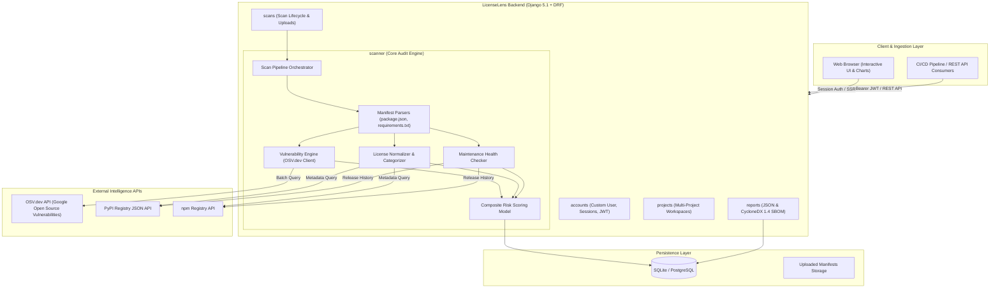

# LicenseLens — Software Dependency Risk & Open-Source Compliance Auditor
> **Comprehensive Architectural Overview, System Design, and Product Vision**

---

## 1. Executive Summary & Vision

**LicenseLens** is an automated **Software Supply Chain Security & Open-Source Compliance Audit Platform** built with **Django 5.1** and **Django REST Framework**.

Modern applications rely on dozens or hundreds of open-source libraries. While this accelerates delivery, it exposes organizations to three major threats:
1. **Security Vulnerabilities (CVEs / GHSAs):** Known exploitable flaws in third-party code.
2. **License Compliance Infringements:** Inadvertent incorporation of restrictive copyleft licenses (e.g., GPL-3.0, AGPL-3.0) into proprietary commercial code, creating severe intellectual property and legal risks.
3. **Maintenance Decay & Abandonware:** Stale or unmaintained packages that no longer receive security patches and are susceptible to supply chain takeovers.

**LicenseLens** acts as an all-in-one dependency auditor and **CycloneDX Software Bill of Materials (SBOM)** generator. Developers and security teams can upload dependency manifest files (`package.json`, `requirements.txt`), inspect real-time risk scores across security, licensing, and maintenance, view interactive dashboards, and generate compliance-grade reports.

---

## 2. High-Level Architecture



---

## 3. Technology Stack

| Layer | Technology | Details |
| :--- | :--- | :--- |
| **Backend Framework** | Django 5.1.4 | High-performance Python web framework |
| **API Framework** | Django REST Framework 3.15.2 | RESTful endpoints with serializers |
| **Authentication** | Django Sessions + `djangorestframework-simplejwt` | Dual-mode: Browser session + JWT token auth |
| **Database** | SQLite (dev) / PostgreSQL (production-ready) | Relational persistence for projects, scans, and vulns |
| **Frontend / UI** | Django Templates + Vanilla JS + Chart.js | Responsive dark cyber-security dashboard aesthetic |
| **Vulnerability Data** | [OSV.dev](https://osv.dev) API | Automated CVE/GHSA resolution across ecosystems |
| **Package Registries** | PyPI JSON API & npm Registry API | Metadata, licensing, and version release dates |
| **Compliance Standard** | CycloneDX 1.4 JSON | Software Bill of Materials (SBOM) specification |
| **Document Generation** | ReportLab 4.2.5 & Pillow | PDF generation capabilities |

---

## 4. Key Subsystems & How They Work

### A. Manifest Parsing
* **npm (`package.json`)**: Extracts `dependencies` and `devDependencies`. Normalizes semantic version specifiers (stripping `^`, `~`, `>=`, `<=`) to determine concrete package versions.
* **Python (`requirements.txt`)**: Parses package identifiers, pin operators (`==`, `>=`, `<=`, `~=`), extras, and ignores environment markers or command line flags (`-r`, `-i`).

### B. OSV Vulnerability Scanner (`scanner/vulnerability.py`)
* Packages are grouped and queried via **OSV.dev Batch API** (`https://api.osv.dev/v1/querybatch`) for maximum speed.
* Resolves identifiers (CVEs, GHSAs), CVSS scores, affected version ranges, publication dates, and specific fixed versions for remediation.

### C. License Normalization & Categorization (`scanner/license_analyzer.py`)
Open-source licenses are normalized from various alias formats and classified into compliance risk buckets:

| Category | Typical Licenses | Legal & Compliance Risk Profile |
| :--- | :--- | :--- |
| **`PERMISSIVE`** | MIT, Apache-2.0, BSD-2/3-Clause, ISC, Unlicense | Low risk. Free commercial use and redistribution. |
| **`WEAK_COPYLEFT`** | LGPL-2.1, LGPL-3.0, MPL-2.0 | Medium risk. Modifications to library itself must be shared. |
| **`STRONG_COPYLEFT`** | GPL-2.0, GPL-3.0, AGPL-3.0, SSPL | High/Critical risk for proprietary software. Viral license terms can force source-code disclosure. |
| **`PROPRIETARY`** | Commercial, Proprietary | Subject to custom agreements, audit rights, or fees. |
| **`UNKNOWN`** | Unspecified or non-standard terms | High risk due to uncertain intellectual property rights. |

### D. Package Maintenance & Obsolescence (`scanner/maintenance.py`)
Queries package registries to retrieve release timestamps:
* **Active:** Latest release within the last 365 days.
* **Low Activity:** 1 to 2 years since last release.
* **Stale:** 2 to 4 years without any release.
* **Abandoned:** Over 4 years without any release (flagged as high risk).

### E. Risk Engine & Composite Scoring (`scanner/risk_engine.py`)
Risk is computed on a 0 to 100 scale using a weighted model:

$$\text{Total Score} = (0.50 \times \text{Security}) + (0.25 \times \text{License}) + (0.15 \times \text{Maintenance}) + (0.10 \times \text{Dependency})$$

#### Score Bands:
* **0–29 (`LOW`):** Clean or minor issues with quick fixes.
* **30–59 (`MEDIUM`):** Outdated packages or moderate vulnerabilities.
* **60–79 (`HIGH`):** Known CVEs or copyleft license conflicts.
* **80–100 (`CRITICAL`):** Exploitable critical CVEs or AGPL viral licenses.

---

## 5. Directory Structure & App Responsibilities

```
LicenseLens_Django/
├── config/                  # Project configuration, database settings, global URLs
├── accounts/                # Custom User model (Email-based auth), login/signup, JWT
├── projects/                # Project catalog, repository URL tracking, ownership
├── scans/                   # Scan lifecycle (PENDING → RUNNING → COMPLETED / FAILED)
├── dependencies/            # Dependency model, ecosystems, versions, parent-child links
├── vulnerabilities/         # Vulnerability models & human-readable RiskFindings
├── scanner/                 # The core analytical engine
│   ├── parsers/             # package.json and requirements.txt extractors
│   ├── vulnerability.py     # OSV.dev batch query client
│   ├── license_analyzer.py  # License normalizer and category classifier
│   ├── maintenance.py       # PyPI and npm registry release cadence analyzer
│   ├── risk_engine.py       # Mathematical risk score calculation
│   └── orchestrator.py      # Scan lifecycle coordinator
├── reports/                 # CycloneDX 1.4 SBOM & JSON report generator
└── frontend/                # Template views, cyber-themed styles, Chart.js graphs
```

---

## 6. Endpoints & API Reference

### Authentication Endpoints
* `POST /api/auth/register/` — Register a new account
* `POST /api/auth/login/` — Authenticate and obtain JWT access & refresh tokens
* `POST /api/auth/token/refresh/` — Refresh an expired JWT access token
* `GET  /api/auth/profile/` — Retrieve user profile and project summary

### Project & Scan Endpoints
* `GET  /api/projects/` — List all user projects
* `POST /api/projects/` — Create a new project
* `GET  /api/projects/{id}/` — Retrieve project metadata
* `POST /api/projects/{id}/scan/` — Upload manifest file and execute a scan
* `GET  /api/projects/{id}/scans/` — List scan history for a project
* `GET  /api/scans/{id}/` — Retrieve scan status and overall risk metrics
* `GET  /api/scans/{id}/dependencies/` — View parsed dependencies with risk scores
* `GET  /api/scans/{id}/vulnerabilities/` — View identified CVEs, CVSS scores, and fixes
* `GET  /api/scans/{id}/report/` — Export executive security audit JSON

### Reporting Endpoints
* `GET  /reports/scan/{id}/json/` — Download full audit JSON report
* `GET  /reports/scan/{id}/sbom/` — Download CycloneDX 1.4 SBOM JSON

---

## 7. Strategic Growth & Roadmap

1. **Asynchronous Processing (Celery + Redis):** Enable non-blocking asynchronous scans with WebSockets (Django Channels) to support enterprise codebases with thousands of dependencies.
2. **Additional Ecosystems:** Extend parsing support to Java Maven (`pom.xml`), Rust (`Cargo.lock`), Go (`go.mod`), and PHP (`composer.json`).
3. **CI/CD Integration & GitHub Actions:** Deploy a pre-built GitHub Action or CLI tool to automatically fail pull requests that introduce `CRITICAL` CVEs or `STRONG_COPYLEFT` licenses.
4. **Policy Governance Engine:** Allow organizations to configure compliance policies (e.g., *"Allow only MIT and Apache-2.0 licenses in production"*).
5. **Automated Remediations:** Suggest automated version upgrades or pull requests (Dependabot/Snyk style) to fix identified CVEs.
6. **Executive PDF Reports:** Leverage the included `reportlab` library to generate formal security certificate PDFs for enterprise vendor assessments.
